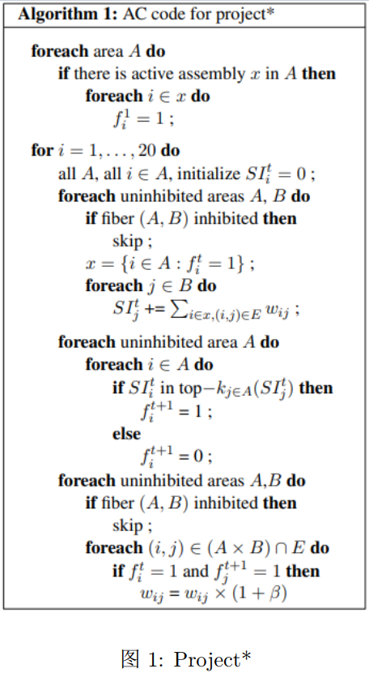
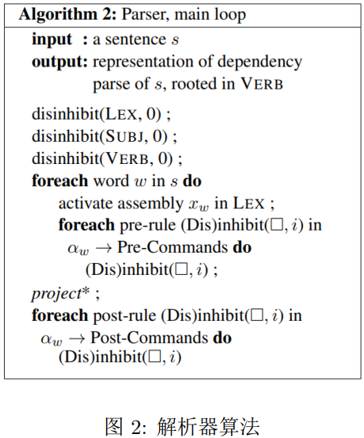
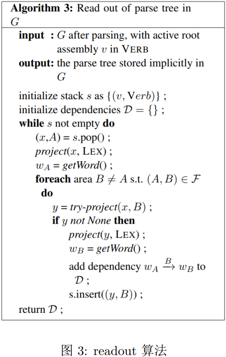
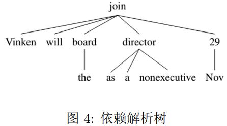
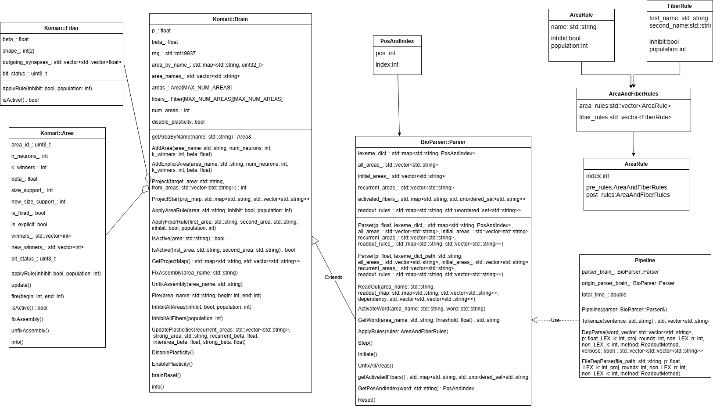
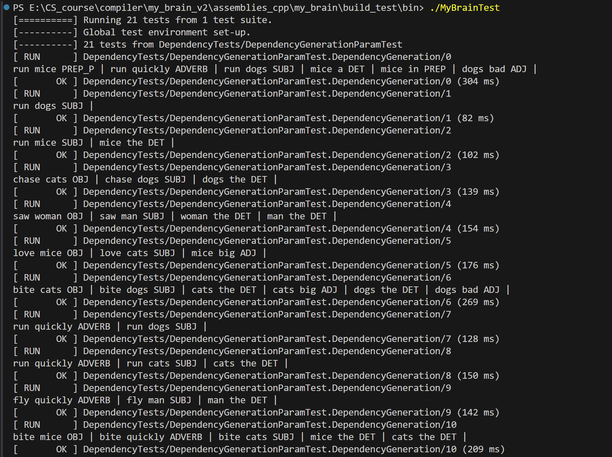
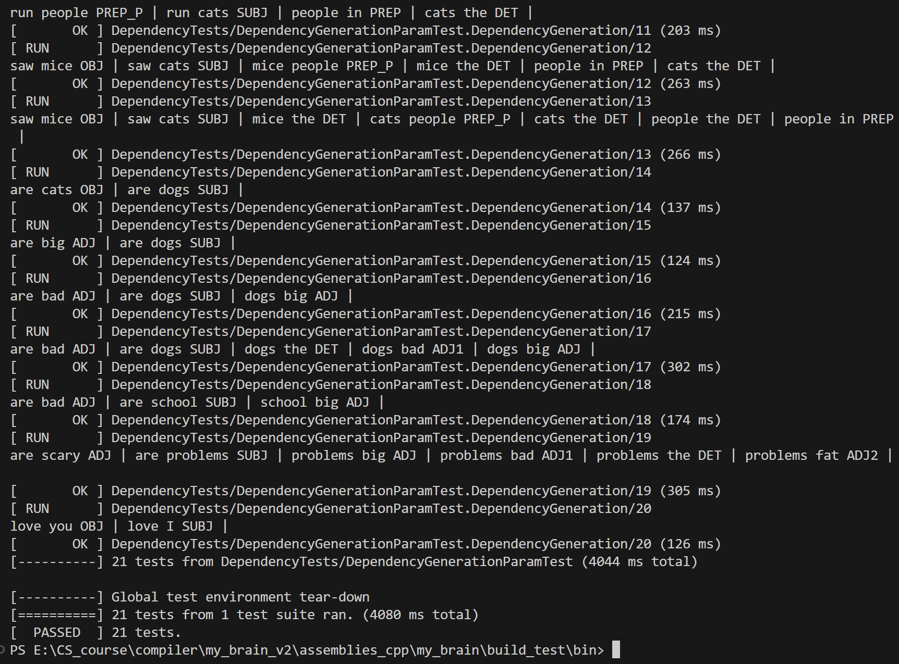

# 编译原理课程设计

## 项目概述

本项目为中山大学编译原理课程设计。我们使用 C++ 重新实现了 Mitropolsky D 等人在 `A biologically plausible parser` 提出的集合演算算法，并利用该算法实现自然语言的依赖解析过程。

本项目采用 C++ 进行开发，使用CMAKE进行编译链管理，使用Google Test进行项目测试。

## 成员分工

小组成员分工如下：

| 姓名 | 学号  | 分工                 |
| ---- | ----- | -------------------- |
| DY   | 20*** | Pipeline，Fiber 读出 |
| LKH  | 21*** | 解析器主体，Fixed_Map 读出   |
| FGB  | 20*** | CMAKE，Google Test   |

## 理论认识

### 大脑模型

在 AC 框架中，大脑由有限个脑区 $A,B,C,\dots$ 和脑区间纤维组成，每个脑区内含 $n$ 个兴奋性神经元。各个脑区内的神经元以概率 $p$ 随机有向连接，形成随机有向图 $G_{n,p}$ ，具体来说，即脑区中任意由两个神经元组成的有序对都以概率 $p$ 相连。每一个突触 $(i,j)$ 都拥有一个权重 $w_{ij}>0$ ，初始化为1，并在模型运作期间动态变化。对于任意脑区的无序对 $(A,B)$，脑区 $A,B$ 之间存在一条纤维连接，从而 $A,B$ 之间形成一个有向二部图。同样地，脑区 $A,B$ 中的神经元有序对以概率 $p$ 形成突触 。总的来说，整个大脑就是一个动态系统，可以视作一个庞大的带权有向图 $G=(N,E)$。
		
大脑生命活动以离散时间步的形式运作。该动态系统（大脑）的状态包括但不限于：

1. 每个神经元 $i$ 在时刻 $t$ 是否放电，写作 $f_i^t\in \{0,1\}$；

2. $E$ 中所有突触的权重 $w_{ij}^t$。

给定以上时刻 $t$ 的状态，时刻  $t-1$ 的状态由以下规则计算：

1. 对于每个神经元 $i$，其时刻 $t$ 的突触输入可以由以下公式计算：
$$
SI_i^t=\sum_{(j,i)\in E,f_j^t=1}w_{ji}^t
$$
即神经元 $i$ 的所有放电入 (incoming) 突触的权重总和。

2. 对于每个 $f_i^{t+1}=1$ 的神经元，它们在时刻 $t$ 的突触输入 $SI_i^t$ 是脑区中最大的 $k$ 个，我们将它们的集合被称为 帽子(cap) 或 k-胜者（k-winners）。其中 $k$ 是 AC 框架中的超参数。

3. 对于每个突触 $(i,j)\in E$，我们有 $w_{ij}^{t+1}=w_{ij}^t(1+f_i^tf_j^{t+1}\beta)$，人话来说，即如果一个突触的前神经元在时刻 $t$ 放电，后神经元在时刻 $t+1$ 放电，那么突触权重会乘上一个因子 $1+\beta$。其中 $\beta$ 是 AC 框架中的超参数，本条规则与大脑可塑性相关。

除了上述动态系统方程，AC 框架还提供了系统的高级控制命令，如令种群 $i$ 抑制脑区的命令 $inhibit(A,i)$，解除种群 $i$ 对脑区的抑制的命令 $disinhibit(A,i)$。所谓种群即一些抑制性神经元，能够抑制脑区中的其它神经元放电。相似地，神经纤维也可以被种群所抑制，也就有了另外俩命令 $inhibit((A,B),i)$ ，$disinhibit((A,B),i)$ ，即种群 $i$ 抑制或解抑制脑区$A,B$ 之间的纤维。

现在我们终于可以定义动态系统在时刻 $t$ 的状态，除了之前提到的 2 点，还包括脑区以及纤维的抑制状态信息。如果一个脑区 $A$ 在时刻 $t$ 被抑制，那么有 $\forall i \in A,j \in (t+1)\dots t',f_i^j=f_i^{t+1}$ ，即被抑制脑区的神经元放电状态在抑制期间不会改变。相似地，如果一条神经纤维被抑制，那么纤维两端的脑区中的神经元不会传递突触输入。

最后我们引出 AC 框架的一个重要角色——神经集(assembly)。神经集是一个包含了 $k$ 个位于同一脑区特殊神经元集合，其中的神经元彼此紧密连接，即它们之间形成的突触数量远高于以概率 $p$ 随机形成的期望突触数，且这些突触拥有极高的权重。神经集可以用来指代人脑中的对象，如一个单词，一个图像或别的什么乱七八糟的玩意。有关它的核心操作“投影”我们会在下一节详述——我们不会把投影操作包括在大脑模型一节中，因为它太重要了。

### 投影

让我们从一个实例开始。假设最初的时刻大脑中没有任何一个神经元放电，此时我们激活脑区 $A$ 中的一个包含 $k$ 个神经元的神经集(assembly) $x$，并假设只有脑区 $B$ 通过一条神经纤维与脑区 $A$ 相连。由于脑区 $A$ 中的神经集的持续放电，脑区 $B$ 中的神经元持续受到影响，并在不同的时刻形成可能不同的帽子（k-胜者），即一个帽子序列 $y^1,y^2,\dots$ 。时刻 0 时，脑区 $B$ 中的神经元只受 $A$ 中神经集 $x$ 影响形成帽子 $y^1$；时刻 1 时，神经集 $x$ 和帽子 $y^1$ 一同决定了 帽子 $y^2$ 的形成。随着时间步的增加，帽子序列高概率收敛于 $B$ 中的一个稳定神经集 $y$，称为 $x$ 在 $B$ 中的投影。帕帕迪米特里等人的多篇论文业已证明或通过实验模拟验证了多个脑区互相之间的投影形成的神经集是收敛的——而这正是 AC 框架的理论基础。除了收敛性，重叠性也是神经集的一个重要性质：最终形成的稳定神经集 $y$，与各个时间步的帽子序列 $y^t$ 会有不小的重叠区域。这个性质是后文提到的读出操作成立的一个前提。

其实我们在上一节中关于动态系统的公式定义中已经阐述了投影的行为，简单来说就是一个脑区的放电神经元对另一个脑区的神经元的影响。投影贯穿整个大脑的生命周期，它决定了各个脑区在各个时刻的放电神经元。这里我们主要考虑投影操作在计算机中的实际实现。

我们这里只分析最简单的情况：脑区 $A$ 中的一个稳定的神经集 $x$ 向脑区 $B$ 中投影。投影可以通过高概率下成立的隐式方式进行，无需进行完全的模拟，从而达到节省空间即加快速度的目的。我们先看看显式的模拟是如何实现。初始化时，脑区 $B$ 中没有神经元被激活，优胜者的选取可以通过多次在二项分布 $B(p, 1-p)$ 中采样来实现，即从前面的二项分布中采样 $k$ 次，等价于与给定包含 $k$ 个神经元的神经集  $x$ 以概率  $p$ 建立随机连接。显式模拟方式下，我们的采样次数为 $k\times n$ 次，其中 $n$ 为脑区中神经元总数；对于拥有大量神经元的脑区而言，这无疑是庞大的开销。那么我们可以利用 $k/n$ 作为阈值，计算二项分布的逆累积分布函数，从而得到优胜者的突触输入的期望下界，并用截尾正态分布模拟不确定性。显式模拟下，我们需要建立一个 $n \times n$ 的庞大的邻接矩阵；而在隐式模拟下，我们可以只为曾经放过电的神经元与其它脑区曾放过电的神经元建立邻接矩阵——显然对未曾放过电的神经元分配存储空间是没有必要的。通过隐式模拟方式，我们可以节省大量的存储空间，同时加快了模拟的过程。

整个大脑的生命活动其实就是所有脑区的互相投影，其可以分解为多个由俩脑区组成的有序对的投影操作，我们将其称为强投影 $(project^*)$ 操作。经过一次强投影（大概需要几十个时间步）后，整个大脑会以高概率达成暂时的稳态。强投影的伪代码如图一所示。

在定义了大脑的生命活动（强投影）后，我们可以利用 AC 框架来实现下文中提到的生物可解释性自然语言解析器。

### 解析器

#### 架构

作者将前文中 $project^*$ 操作称为强投影，将基于强投影操作的神经元集合演算称为$\text{sAC}$(强神经元集合演算)。解析器就是一个模拟$\text{sAC}$的程序，数据结构表示为一个前文中提过的无向图 $G=(\mathcal{A},\mathcal{F})$，其中，$\mathcal{A}$ 表示脑区，$\mathcal{F}$ 表示神经元集合。

脑区有 $\text{LEX}$、$\text{VERB}$、$\text{SUBJ}$、$\text{OBJ}$、$\text{DET}$、$\text{ADJ}$、$\text{ADV}$、$\text{PREP}$、$\text{PREPP}$ ，也可以根据需要扩展到 $\text{CONJ}$、$\text{CLAUSE}$。

$\text{LEX}$ 脑区是特殊脑区，其中包含了所有单词的固定神经元集合，连接到所有的其他脑区。除了$\text{LEX}$ 之外的其他脑区属于前文中的标准脑区，即相互之间以概率$p$随机有向连接，每个脑区之中包含$n$个随机连接神经元，某一时间步中最多$k$个被激活。

单词 $w$ 的神经元集合数学表示为 $x_w$。$x_w$被激活，除了和前文中神经元激活的效果之外，还执行这个单词对应的短程序 $\alpha_w$ ，$\alpha_w$在激活之前和之后进行一些抑制（$\text{Disinhibit}$）与去抑制（$\text{Inhibit}$）操作。这段内容可以总结为，$\text{LEX}$ 区域中的单词 $w$ 对应的神经元集合 $x_w$，一旦激活，执行三个步骤：

1. 执行前命令（可能包含抑制与去抑制）
2. 执行激活的$project^*$操作本身
3. 执行后命令（包含抑制与去抑制）

我们的理解是，因为不希望神经元集 $x_w$ 乱投影到毫无意义的区域中，所以通过这种人为设计的规则（引入外部知识），限制了投影能到哪些脑区。

解析器算法伪代码如图2所示。

#### 读出

作者经过上述算法之后，句子的依赖解析树已经隐式表示为 $G$ 中脑区之间的连接  $w_{ij}$ 了。作者设计了一个$readout$算法（算法输入是图$G$的状态，也可以只用 $w_{ij}$ 与$\text{VERB}$ 中最后$k$个激活的神经元，输出是一个依赖列表）。

为了表述方便，定义了一个 $\text{try-project}(x,B)$ 操作，是一个尝试性操作，意思是某脑区中$x$投影到脑区$B$，如果能在$B$中形成一个稳定的神经元集，就执行$project$并返回$B$中形成的神经元集，否则就回滚（不执行）并返回$\text{None}$。

定义了一个 $getWord()$ 函数用于从$\text{LEX}$中激活的神经元集 $x_w$ 得到对应的单词，实验中会遍历词表中的单词，查看 $\text{LEX}$ 脑区中是否存在一个代表单词的神经集与当前激活的神经元集的重叠部分达到了一个百分比阈值，如果存在，则返回第一个这样的单词，否则返回 $\text{None}$。

因此，可以通过两个步骤找到有依赖关系的单词。首先通过$\text{y=project}(x,A)$，找到属于一个脑区的神经元集合x在A脑区中有依赖关系的神经元集合y，再通过$\text{project}(y,Lex)$找到y对应的单词。

readout算法伪代码如图3所示。其思想主要是构建出类似于下图4所示的依赖树。从动词及其脑区开始（因为认为动词时一个句子的核心，通过动词，主语和宾语等其他成分构成依赖关系），遍历其他脑区并应用上述提到的两个步骤，找到其具有依赖关系的其他单词及其脑区，保存这些依赖关系，再对找到的单词递归搜索其依赖的词语，最终构建出解析树。

用深度优先搜索的方式构建伪代码的过程如下。先将动词及其脑区压栈，之后不断弹栈，对于弹出的 $(x,A)$（其中$x$是神经元集，$A$是其所在的脑区），反向投影到$\text{LEX}$脑区获得单词$w_A$，并且对于不同于$A$的其他脑区$B$，尝试投影 $\text{try-project}(x,B)$ 得到$B$中的$y$，如果可以得到稳定激活的神经元集，将 $y$ 投影到$\text{LEX}$区域中得到对应单词$w_B$，因为 $y$是$x$投影得到的，我们就说$w_A\xrightarrow{B}w_B $，并可以将 $(y,B)$ 压栈。

剩余内容作者解释了$readout$ 算法不只是理论证明，生物学上也是合理的。往另一个脑区和往Lex脑区投影的操作，可以通过神经元、突触等结构实现。由于投影总是基于上一次投影的结果，因此递归的操作也可以通过强投影操作实现。同时生物结构也一样能判断是否收敛，如果在另一个脑区投影后形成不了有依赖关系且稳定的神经元集合，那么再向Lex脑区投影也不收敛，没有反应也就是返回 $\text{None}$。

#### 论文实验

作者在实验中按照本文预设的组织方式提供了Python的解析器实现，也就是符合$\text{LEX}$ 预设、抑制机制、高层结构由底层神经元行为决定的。实验中手工设计了200个句子用于展示解析器正确解析。虽然理论上有可能出现低概率的失败，但是实验中并未出现。另外，作者讨论了包含从句的句子也将被正确处理。最终实验结果中，在合理设置超参数情况下，解析器解析速度约为每个单词 0.2-0.5 秒。在我们的 C++ 实现中，解析速度可高达每个单词 0.02-0.05 秒。

## 项目设计

### 数据对象

在本项目中，数据对象主要包含词汇、脑区和规则信息，这些对象在解析自然语言时发挥关键作用。

1. **词汇对象（Lexeme Dictionary）**：
   - 存储在 `lexeme_dict_` 中的一个 `std::map`，键为词汇，值为词性及索引的结构 `PosAndIndex`。
   - `PosAndIndex` 结构体包含词性（`pos`）和词汇索引（`index`）。
2. **脑区对象（Areas）**：
   - 以 `std::vector<std::string>` 形式存储在 `all_areas_` 中，代表解析过程中涉及的所有脑区。
   - 初始脑区和自循环脑区分别存储在 `initial_areas_` 和 `recurrent_areas_` 中。
3. **规则对象（Rules）**：
   - 包含脑区规则 `AreaRule` 和纤维规则 `FiberRule`。
   - `GenericRules` 结构体用于存储词汇解析过程中预先和事后的脑区及纤维规则。

### 类交互

项目中主要类包括 `Parser` 类和 `Pipeline` 类，此外还有若干常量和规则定义的头文件。

1. **Parser 类**：
   - 负责自然语言解析的核心功能。
   - 提供词汇激活、规则应用、词汇获取、解析器状态重置等功能。
   - 通过调用 `ActivateWord`、`ApplyRules`、`GetWord`、`Step`、`Initiate`、`UnfixAllAreas` 等方法实现具体的解析操作。
2. **Pipeline 类（向斯坦福核心自然语言处理看齐）**：
   - 负责协调和执行解析流程。
   - 提供分词 `Tokenize` 和依赖解析 `DepParse` 功能。
   - 提供文件级别依赖解析 `FileDepParse`，读取文件逐行解析句子。
   - 通过调用 `parser_brain` 实例的方法完成解析工作，并在每次解析后重置解析器。
3. **类间交互**：
   - `Pipeline` 类通过持有 `Parser` 类的引用，与其进行交互。
   - 解析器解析每个句子时，`Pipeline` 类会调用 `Parser` 的方法。
   - 解析过程中涉及的规则和常量存储在相应的头文件中，供 `Parser` 和 `Pipeline` 使用。

数据对象和类交互关系如下图所示：

### 线程安全

本项目中使用了 OpenMP 进行并行化处理，以提高代码性能。在设计线程安全性时，考虑以下几个方面：

1. **并行区域**：
   - 在涉及到 OpenMP 并行区域时，确保各个线程操作的数据是独立的，避免数据竞争。
   
2. **共享资源**：
   - 对于 `Parser` 类中的共享资源（如 `lexeme_dict_`），在并行区域内只进行只读操作，确保线程安全。
   - 在需要修改共享资源时，使用 OpenMP 的 `critical` 区域或其他同步机制，确保线程安全。
3. **数据竞争与同步**：
   - 通过分析并行代码，确保不存在数据竞争。
   - 使用 OpenMP 提供的同步机制，如 `omp critical`，确保共享资源的安全访问。

### 代码性能测试

为了评估和优化代码性能，我们进行时间性能测试。

1. **性能测试工具**：
   - 通过使用 C++ 标准库 `chrono` 测量并行区域的时间。
2. **性能测试方法**：
   - 编写多种句式的测试用例，通过测量函数执行时间，评估代码性能。
3. **性能优化**：
   - 通过分析测试结果，识别性能瓶颈：投影操作由于频繁涉及突触相关邻接矩阵的空间再分配，并行度很难进一步提高。
   - 优化数据结构和算法：涉及存储大脑和纤维的抑制种群时，利用位图替代 `std::set`。
   - 使用 OpenMP 进行并行化处理，充分利用多核 CPU 提高处理速度。
4. **并行区域考量**
   - 我们没有对多句解析的循环进行并行化处理，因为正常人脑很难一次处理两个句子的依赖解析。我们主要针对投影操作进行了最大程度的并行处理，但受限于计算机的存储空间，我们不可能对每个脑区都采取显式模拟的方式，只能采取隐式模拟——而这导致了并行化区域的缩减。我们认为，真实人脑中的投影操作的可并行程度应当比代码呈现出来的并行化程度要高得多。

#### 性能测试数据
| 是否并行 | 处理频率  | 处理速度 |
| ---- | ----- | ---------------|
| 无并行化  | 0.0650451 s/word | 15.374 words/s
| 并行化   | 0.0519322 s/word | 19.2559 words/s 

从以上数据来看，由于并行化区域有限，多线程带来的加速并不十分明显（但也不容小觑）。

### 代码功能测试

使用 google test 验证单词库中所有单词组成的在满足英语语法规则下的简单句均可解析成功。

#### 测试逻辑
1. 源代码实现了FileDepParse()函数，使得程序能够读入一个句子文件进行解析，但是用gtest直接测试这个函数无法看到每个测试样例的反馈，因此测试DepParse()函数，DepParse()是对一个句子进行依赖解析的函数。
2. DepParse()函数输入一个句子返回句子的依赖，其数据类型为`vector<vector<string>>`,外面的`vector`存放了句子的所有依赖，其中`vector<string>`是其中的一条依赖，每条依赖由三个字符串表示，其含义为：当前单词，目标单词，关系，我们称之为依赖三元组
3. 由于使用FIXED_MAP_READOUT读出规则，会产生无用的含有`<Not A Word>`的依赖，故将含有`<Not A Word>`的依赖三元组去掉
4. 将依赖三元组`vector<string>`拼接成一个字符串
5. 将依赖字符串存入set中,用set能保证比较相同的时候不受顺序的影响
6. 最后比较两个set是否相同

#### 测试结果
指定单词库下，论文中提及的句法结构都能成功解析。测试中输出的是依赖解析的结果。

## 讨论
### 克林星闭包
我们的实验证明，原作者实现的解析器根本无法解决克林星闭包，也就是无法处理同一个词性相同的单词连续出现的情况。如果它们号称该解析器能够解析自然语言，那么它至少应当能够处理最基本的正则语言。在同一词性单词连续出现的情况下，连续的投影导致连续的投影结果（神经集）融合，此时神经集中所包含的是杂糅的信息而非完整的信息了。

论文给出了俩解决方案：
+ 增加俩新脑区 ADJ1、ADJ2，第一个形容词依旧投影到原来的 ADJ1，第二个则投到 ADJ2，第三个重新投到 ADJ1，第四个又投到 ADJ2，循环往复。这个解决方案依赖于脑区间的**单向**纤维，也就是 ADJ1 和 ADJ2 之间需要存在单向投影，例如 LEX 向 ADJ1 投影的时候 ADJ2 也必须向 ADJ1 投影。
+ 增加一定数量的脑区 ADJ1, ADJ2, ADJ3...，用来存储多个连续的形容词。这个解决方案不依赖于单向纤维，双向即可。但是该方案不能解析包含重复出现的任意数量同词性单词的句子。

我们的实验采取了第二种解决方案（省事），实现了至多三个连续形容词的解析，证明了第二种方案的可行性。但是其它情况，例如连续的介词短语、副词的情况尚未处理，不过实现的原理大差不差。

### 迪克语言
当前的解析器显然无法处理迪克语言，因为它没有一个类似栈的存储结构，也就意味着它无法处理上下文无关语言。作者的其它工作中号称解决了这一问题（但其实它们代码实现的递归解析器错漏百出）。

### AC 框架的前景？
我们仅仅解析一些自然语言中最简单的句子，就得不胜其烦地设计十几条乃至几十条对于脑区和纤维的控制规则，这实在令人沮丧。这些工作本应由大脑自己完成，即大脑应当具备学习的能力。此外，与其说本次课设的产物是自然语言解析器，不如说它仅仅是一个大脑模型的模拟器——它所完成的解析，仅仅停留在正则语言乃至上下文无关语言的层面。AC 框架需要一个与人脑学习相关的应用来进一步证明它的价值。

*当然，（有时）发现问题是简单的，难点在于解决。*

### 附加项目
恐怕斯坦福核心自然语言处理模块的分量是集合演算框架当前无法承受之重。反过来，集合演算当前也应当不会对斯坦福核心自然语言处理模块有任何性能上的帮助。与其浪费时间于无意义的实验上，不如进一步完善大脑计算的相关理论研究。